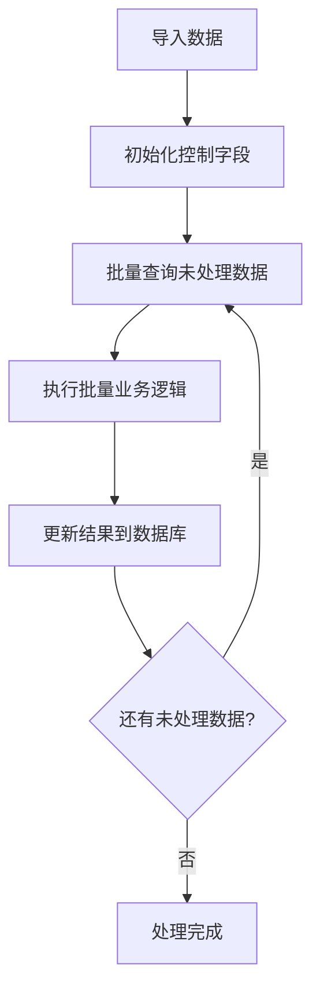

# {{ cookiecutter.project_name }}

{{ cookiecutter.description }}

## 项目信息

- **项目名称**: {{ cookiecutter.project_name }}
- **作者**: {{ cookiecutter.author_name }} ({{ cookiecutter.author_email }})
- **数据源**: {{ cookiecutter.data_file }}
- **批处理大小**: {{ cookiecutter.batch_size }}

## 快速开始

### 1. 安装依赖

```bash
pip install -r requirements.txt
```

### 2. 准备数据

将你的数据文件放在项目根目录下，命名为 `{{ cookiecutter.data_file }}`

数据文件应包含以下基本列:
- 主键字段(如 `id`)  
- 业务相关字段(根据你的需求)

### 3. 修改业务逻辑

打开 `main.ipynb`，你需要修改以下3个方法:

#### 3.1 定义表结构 (`define_schema`)

```python
def define_schema(self) -> Dict[str, list]:
    return {
        'control_fields': [
            'is_processed',    # 系统字段，勿删
            'retry_count'      # 系统字段，勿删
        ],
        'result_fields': [
            'your_result1',    # 替换为你的结果字段
            'your_result2',    # 替换为你的结果字段
        ]
    }
```

#### 3.2 实现业务逻辑 (`process_business_logic`)

```python  
def process_business_logic(self, batch_data: pd.DataFrame) -> pd.DataFrame:
    # 如果需要调用外部API，可以使用:
    # external_data = self.fetch_external_data(batch_data)
    
    # 实现你的核心业务处理逻辑
    for idx, row in batch_data.iterrows():
        # 执行数据比对、计算、判断等
        batch_data.loc[idx, 'your_result1'] = 'value1'
        batch_data.loc[idx, 'your_result2'] = 'value2'
    
    return batch_data
```

##### 并行处理（可选，推荐用于 IO 密集场景）

提供一个简单的并行语法糖 `@parallel(pool_size=5)`，用于将单条任务的处理并行化：

```python
from utils import parallel, join_all

def process_business_logic(self, batch_data: pd.DataFrame) -> pd.DataFrame:
    @parallel(pool_size=5)
    def handle_one_task(row):
        # 执行你的 IO/网络调用等耗时操作
        return {
            'your_result1': 'value1',
            'your_result2': 'value2',
        }

    futures = [handle_one_task(row) for _, row in batch_data.iterrows()]
    results = join_all(futures)
    handle_one_task.pool_shutdown()

    for (idx, _), res in zip(batch_data.iterrows(), results):
        batch_data.loc[idx, 'your_result1'] = res.get('your_result1', '')
        batch_data.loc[idx, 'your_result2'] = res.get('your_result2', '')

    return batch_data
```

说明：
- `pool_size` 控制并发度（线程池），适合 IO 密集（如 API 请求）。
- `f.join()` 等价于 `future.result()`，会在任务完成后返回结果。
- 使用完成后调用 `handle_one_task.pool_shutdown()` 以释放线程资源。

#### 3.3 (可选) 实现API调用 (`fetch_external_data`)

```python
def fetch_external_data(self, batch_data: pd.DataFrame) -> Dict[str, Any]:
    # 如果需要调用外部API，请实现此方法
    # 例如: 批量查询订单、用户信息等
    return {}
```

### 4. 运行处理

在Jupyter中执行最后的运行单元格即可:

```python
processor = YourProcessor(...)
processor.run()
```

## 框架特性

### 核心功能
- ✅ **标准化流程**: 数据导入 → 批处理 → 结果回填
- ✅ **断点续传**: 基于游标ID实现断点续传
- ✅ **错误重试**: 自动重试失败的记录
- ✅ **进度跟踪**: 实时显示处理进度
- ✅ **结果导出**: 支持CSV/Excel格式导出

### 高级特性
- 🚀 **缓存支持**: 已启用已禁用API调用缓存
- 📊 **统计报告**: 详细的处理统计信息
- 🔧 **灵活配置**: 可配置批次大小、重试次数等
- 📝 **完整日志**: 详细的处理日志记录

## 配置说明

主要配置项在 `config.py` 中:

```python
# 数据库配置
DB_CONFIG = {
    'batch_size': {{ cookiecutter.batch_size }},     # 批处理大小
    'max_retries': {{ cookiecutter.max_retries }}    # 最大重试次数
}

# 缓存配置
CACHE_CONFIG = {
    'enable': {{ 'True' if cookiecutter.enable_cache == 'y' else 'False' }},
    'size': {{ cookiecutter.cache_size }}
}
```

## 处理流程



## 示例项目

参考 `example.ipynb` 查看完整的业绩归因判断示例，包含:

- 订单归因API调用
- 员工信息查询  
- 业绩匹配判断
- 结果统计分析

## 常见问题

### Q1: 如何处理大数据量?
调整 `batch_size` 参数，建议50-200之间

### Q2: 处理失败怎么办?
框架会自动重试，可通过 `max_retries` 配置重试次数

### Q3: 如何查看处理进度?
运行过程中会实时打印进度信息，也可以调用 `get_statistics()` 查看

### Q4: 如何暂停和恢复处理?
直接停止运行，下次启动会从上次的位置继续处理

### Q5: 如何处理失败重试?
框架支持智能的失败重试机制：

**场景**: 处理了100个批次，其中2个批次失败，如何重试？

**解决方案**:
1. 直接重新运行相同的 `processor.run()` 代码
2. 框架会自动检测到已存在的数据表
3. 系统会询问你的选择：
   - `[s] 跳过导入` - **推荐选择**，直接处理失败的记录
   - `[r] 覆盖导入` - 删除所有数据，重新开始

**最佳实践**:
```python
# 失败重试时，选择"跳过导入"
processor.run()  # 系统询问时选择 [s]

# 如需强制重新开始，可以使用:
processor.run()  # 系统询问时选择 [r]
```

**注意**: 
- 跳过导入会保留已成功处理的记录，只重试失败的批次
- 覆盖导入会删除所有记录，从头开始处理
- 框架会自动跳过 `retry_count >= max_retries` 的记录

## 许可证

MIT License
